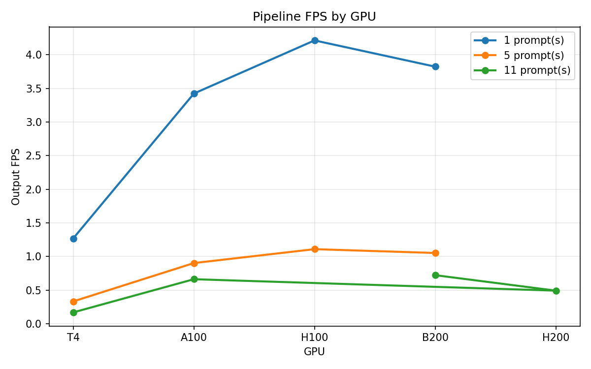
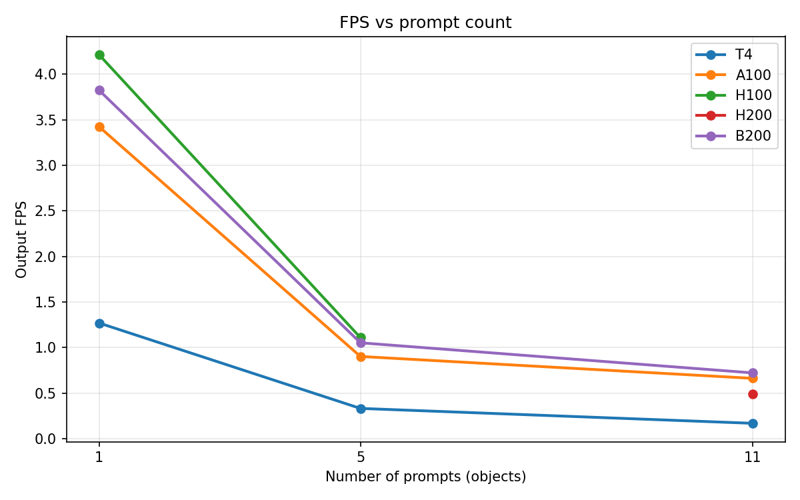
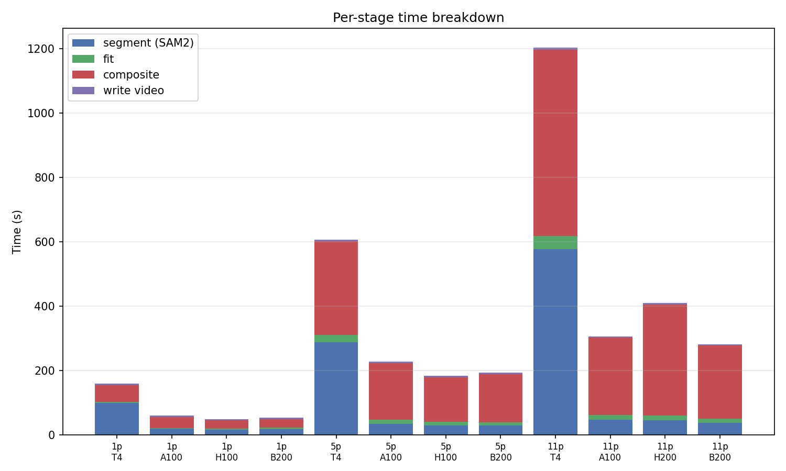
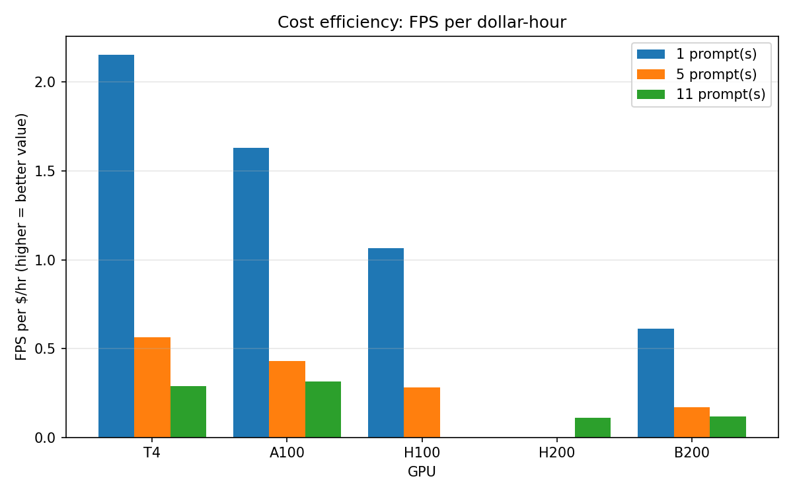

# Benchmark Matrix Report

Input: **202 frames** (8.1s) at the original resolution.

Each row is the mean across 3 benchmark runs.

## Summary table

| Prompts | GPU (actual) | $/hr | Total time (s) | Output FPS | Segment (s) | Fit (ms/frame) | Composite (ms/frame) |
|---:|---|---:|---:|---:|---:|---:|---:|
| 1 | T4 | $0.59 | 159.0 | **1.27** | 97.7 | 18.7 | 257.9 |
| 1 | A100 | $2.10 | 59.1 | **3.42** | 18.7 | 10.2 | 169.1 |
| 1 | H100 | $3.95 | 48.1 | **4.21** | 15.2 | 16.8 | 128.6 |
| 1 | B200 | $6.25 | 53.0 | **3.82** | 16.9 | 22.2 | 133.1 |
| 5 | T4 | $0.59 | 605.9 | **0.33** | 286.6 | 116.6 | 1438.0 |
| 5 | A100 | $2.10 | 226.2 | **0.90** | 34.0 | 60.5 | 872.2 |
| 5 | H100 | $3.95 | 182.4 | **1.11** | 28.9 | 50.7 | 691.6 |
| 5 | B200 | $6.25 | 191.9 | **1.05** | 29.2 | 45.9 | 737.8 |
| 11 | T4 | $0.59 | 1201.7 | **0.17** | 576.2 | 202.7 | 2868.1 |
| 11 | A100 | $2.10 | 305.2 | **0.66** | 45.8 | 77.9 | 1189.6 |
| 11 | H200 (req H100) | $4.54 | 408.3 | **0.49** | 44.2 | 78.4 | 1701.0 |
| 11 | B200 | $6.25 | 279.7 | **0.72** | 36.2 | 67.2 | 1125.3 |

> **Note:** Modal allocated a different GPU than requested for some runs:
> - Requested `H100`, got `H200` (11 prompts)

## Key findings

- **Fastest run:** 4.21 FPS — H100 with 1 prompt(s)
- **Real-time target:** 25 FPS (input video framerate). Best run is 5.9x slower than real-time.
- **Best value:** T4 with 1 prompt(s) — 2.153 FPS per $/hr

## Plots

